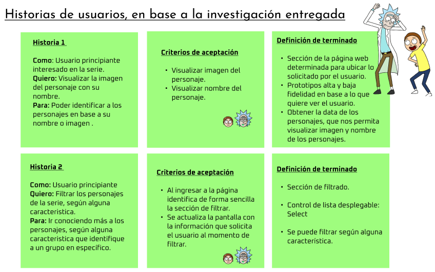
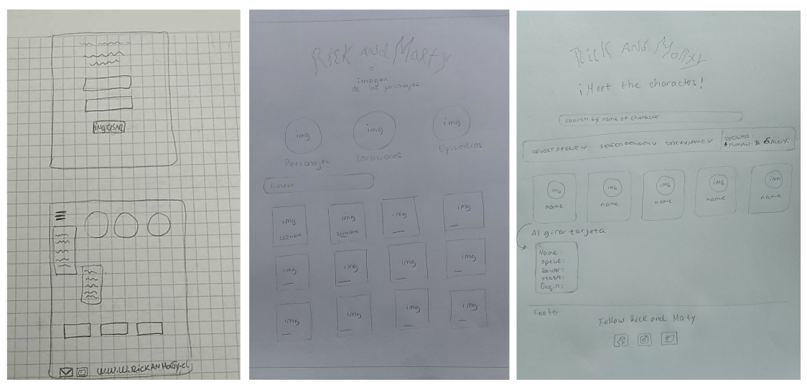
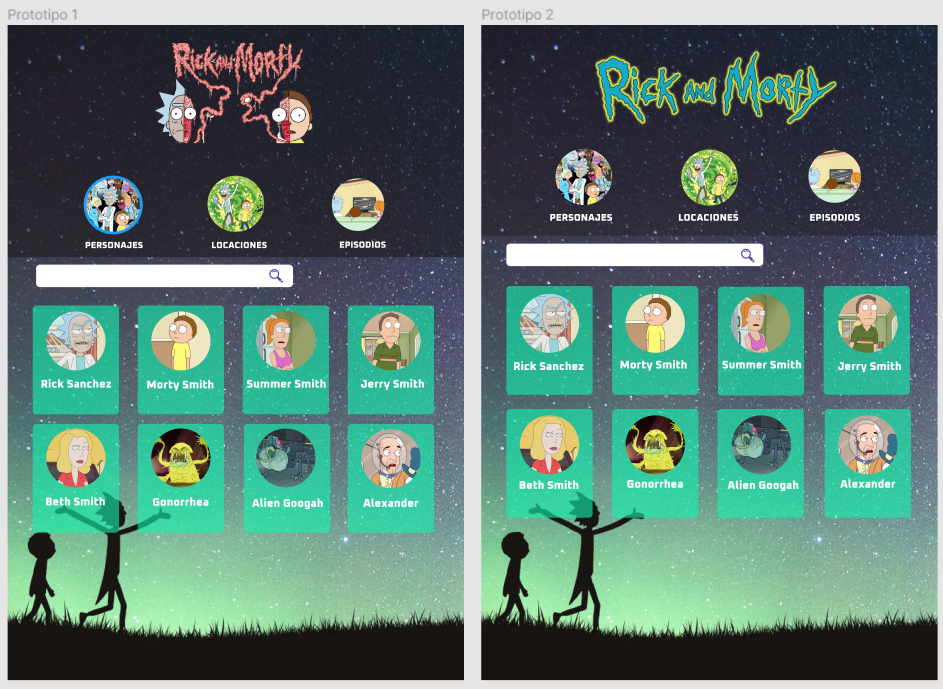
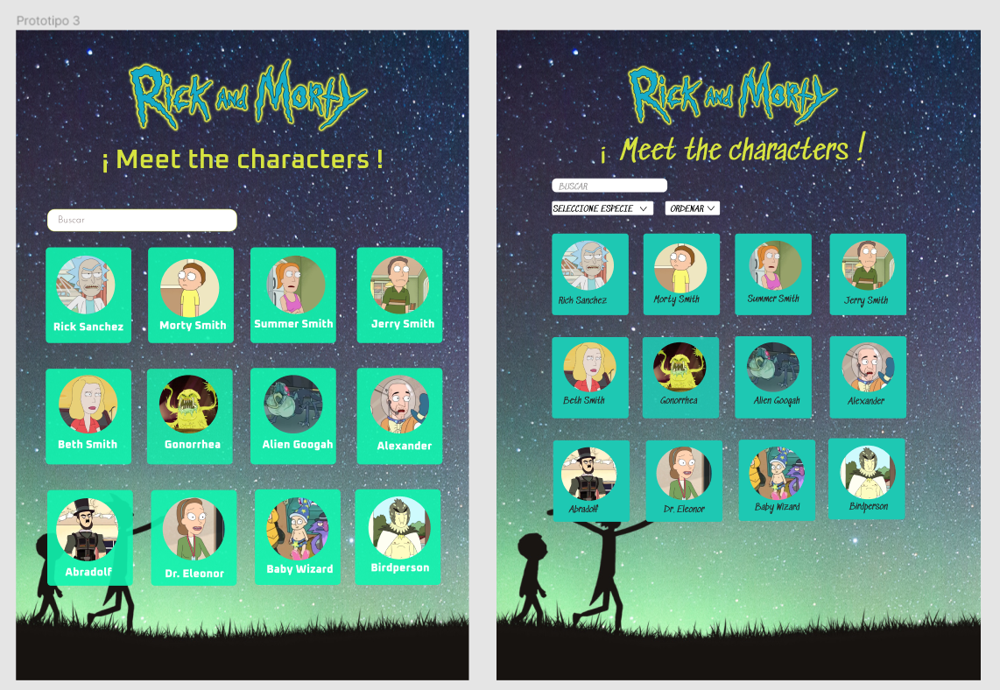
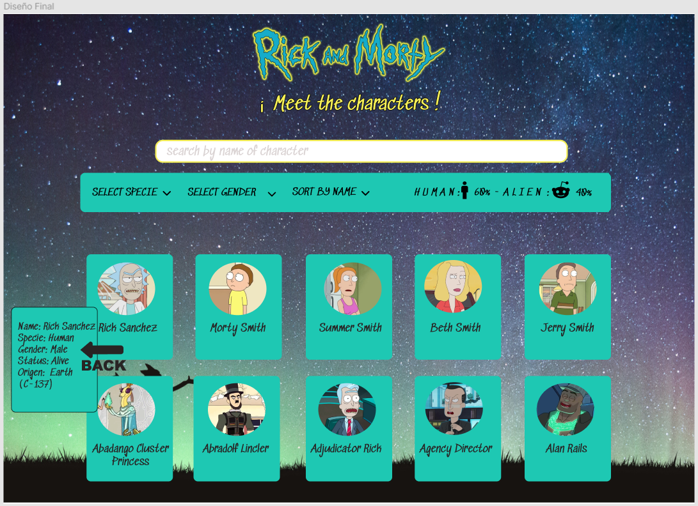

# Proyecto: Data Lovers - Rick and Morty 

## Índice

* [1. Resumen del proyecto](#1-resumen-del-proyecto)
* [2. Historias de Usuario](#2-historias-de-usuario)
* [3. Diseño de la Interfaz de Usuario](#3-diseño-de-la-interfaz-de-usuario)
* [3.1. Prototipo de baja fidelidad](#3.1-prototipo-de-baja-fidelidad)
* [3.2 Prototipo de alta fidelidad](#3.2-prototipo-de-alta-fidelidad)
* [3.3 Testeos de usabilidad](#3.3-testeos-de-usabilidad)
* [3.4. Diseño final](#3.4-diseño-final)
* [4. Pruebas unitarias](#4-pruebas-unitarias)

***

## 1. Resumen del proyecto

En este proyecto se solicito construir una página web para visualizar un
conjunto (set) de datos, que se adecuara a lo que descubriesemos que el 
usuario requería. 
Como entregable final logramos una página web que permite visualizar la data,
filtrar, ordenar y se obtuvo un cálculo agregado. 
Dentro de los datos propuestos, elegimos el set de Rick and Morty, el cual 
nos proporcionaba la lista de personajes de la serie. 

## 2. Historias de Usuario 

De acuerdo a la investigación entregada, la cual se basa en los seguidores 
de Rick and Morty; realizamos nuestras 4 Historias de usuario, éstas cuentan con 
criterios de aceptación y definición de terminado. 

## 3. Diseño de la Interfaz de Usuario

### 3.1 Prototipo de baja fidelidad

### 3.2 Prototipo de alta fidelidad

### 3.3 Testeos de usabilidad 

Se realizaron encuestas personalizadas de usabilidad(Feedback compañeras) con distintos usuarios, 
a través de ellas se detecto: 

- En el primer prototipo de alta fidelidad, el logo(imagen) elegido, no era legible para el usuario.
Debido a ello, se cambia la imagen al logo característico de la serie, el cual era más legible y tenía
buen contraste con el fondo de la interfaz web. 

- Las tarjetas que contenían la imagen e información de los personajes contaban con una opacidad al 60%,
la cual no permitiría ver bien la información de éstos, por ello se deja finalmente con un color sólido.

- El idioma del set de datos está en inglés y se estaba trabajando con idioma español, por lo tanto, 
se adapta al idioma correspondiente de la data proporcionada. 

- Se contaba con una estilo de fuente que no conjugaba con el estilo del logo(imagen) de la interfaz, 
por lo tanto, se cambia a otro estilo de fuente proveniente de Google fonts.

### 3.4 Diseño final y responsive de UI

## 4. Pruebas unitarias (unit tests)

