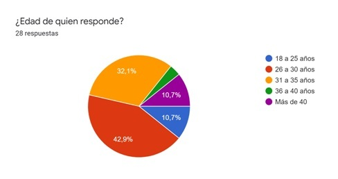
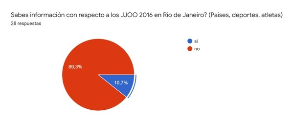
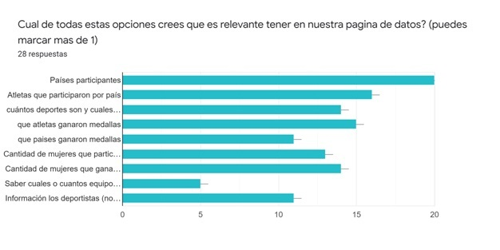
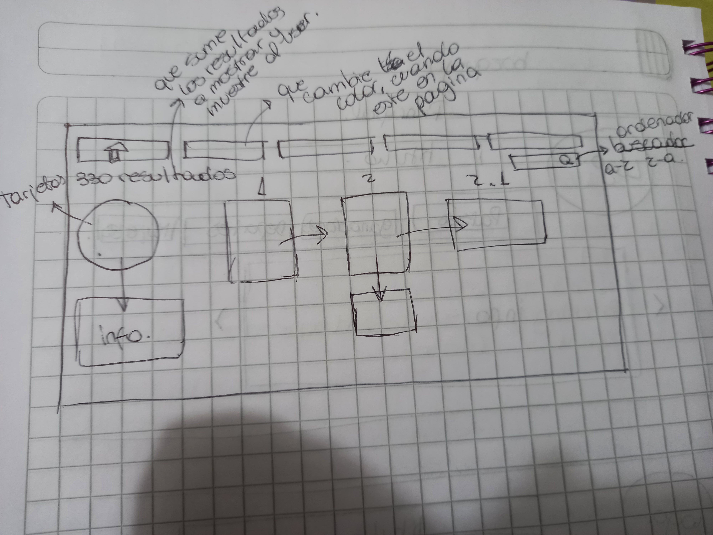
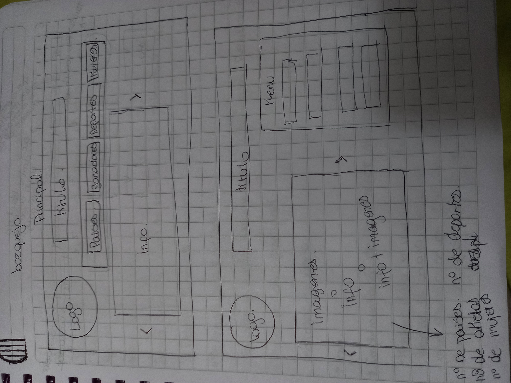
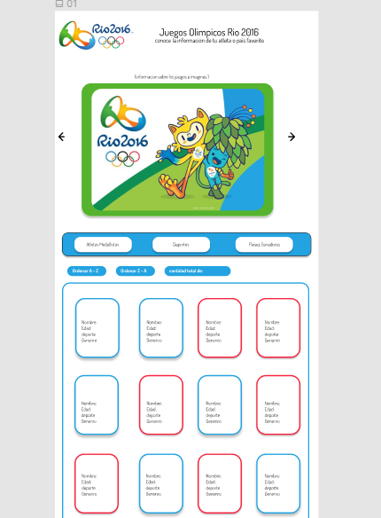

# Data Lovers

## Índice

* [1. Definición](#1-definición)
* [2. Investigacion UX](#2-investigacion-ux)
* [3. Historias de Usuarios](#3-historias-de-usuarios)
* [4. Testeos](#4-testeos)
* [5. Feedback](#5-feedback)

***

## 1. Definición

Nuestro proyecto es diseñar y realizar una web donde se puedan manipular los datos de los atletas medallistas, entendiendo que puedan visualizar y manipular la informacion de los JJOO Rio 2016, informacion esencial de este evento mundial.

El objetivo de nuestra página es que los usuarios puedan ordenar alfabeticamente y filtrar por genero, deporte  o pais de los atletas medallistas de este evento.
Para ello utilizamos un interfaz amigable y entendible para cualquier persona, ademas que sea responsive adaptable a  distintos dispositivos.

## 2. Investigacion UX

Para la investigacion de usuarios nosotras  nos basamos en la informacion recopilada mediante un cuestionario de google,  el cual compartimos en RRSS.
El resultado de es el siguiente:

"Nuestros usuarios son adulto joven, ya que el rango etario fluctúa entre los 26 a 35 años como nos muestra el gráfico."

## 3. Historias de Usuarios

Mediante el cuestionario utilizado pudimos extraer que: 

Los usuarios de nuestra web no conocen información de los JJOO río 2016.
Para resolver este primer paso es que entendemos que nuestra página debe ser sencilla y precisa con la información relevante.
Para trabajar en esta interfaz  extrajimos la base de datos que trae el proyecto y con ellos hemos creado funciones y variables que podamos utilizar y mostrar de forma clara para nuestros usuarios, hemos trabajado con JS y realizamos los test para comprobar el correcto funcionamiento del código.

Empezamos realizando un slaider con imagenes  y una breve informacion general que los usuarios desean conocer.
Nos basamos en el siguiente grafico para mostrar datos:

 

  INFO SLIDER
* Países participantes.
      Como usuario, quiero ver los países que participaron, para conocimiento general y ver si su país de origen participó en los JJOO.
      
* Cantidad de mujeres que participaron.
      Como usuario, quiero conocer la cantidad o % de mujeres que participan en JJOO, para saber si hemos evolucionado la participación femenina.

* Cantidad de deportes y disciplinas que se realizaro.

Luego nos centramos en las siguientes Historias a desarrollar: 

* Historia 1 utilizando filter
      Como usuario, quiero separar los atletas segun su género.
      Para informarnos y conocer cómo ha evolucionado su participación segun sexo.  
      FILTRO donde aparecerá una división por género y desde ahí saldrá la información de los atletas que ganaron medallas.
 
 
* Historia 2 
      "cuántos deportes son y cuales son sus disciplinas".
      Como usuario, quiero  filtrar por deportes que participaron.
      Para buscar por deporte favorito y poder ver a los atletasparticipantes.
      
  
* Historia 3  
      "Que paises ganaron medallas".
      "Atletas que participaron por país".
      Como usuario, quiero poder ver a los atletas  que participaron por país
      Para buscar por país que ganó y obtener la informacion de los atletas y tipos de medallas que ganaron.
 
  
 ***
 
Dentro de la interfaz utilizada decidimos emplear tarjetas que nos muestre la informacion de cada atleta.
    "Información de los deportistas (nombre, país deporte y medalla)".
    Como usuario, quiero conocer información más detallada de cada atleta, para conocer mejor de acuerdo a sus datos básicos.
 

#### Prototipo de baja fidelidad
 
Prototipo de baja fidelidad

 

 

 Prototipo de alta fidelidad

 

## 4. Testeos

Durante este proyecto realizamos los tests correspondiente a las funciones que empleamos, todos nuestros test pasaron sin problemas.

## 5. Feedback

En los sprint de nuestro proyecto en varias oportunidades tuvimos feedback de nuestras compañeras, los que hemos tomado para mejorar tanto lo visual como su funcionalidad.
En estas instancias pudimos testear la funcionalidad de nustra pagina y como la reciben los usuarios, para ir mejorandola en caso de que sea necesario, cada comentario lo revisamos e implementamos.

